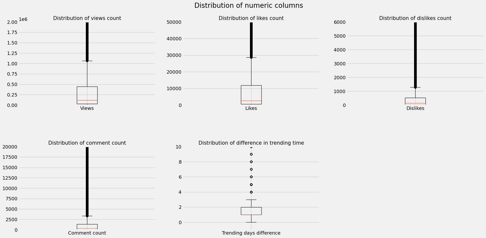
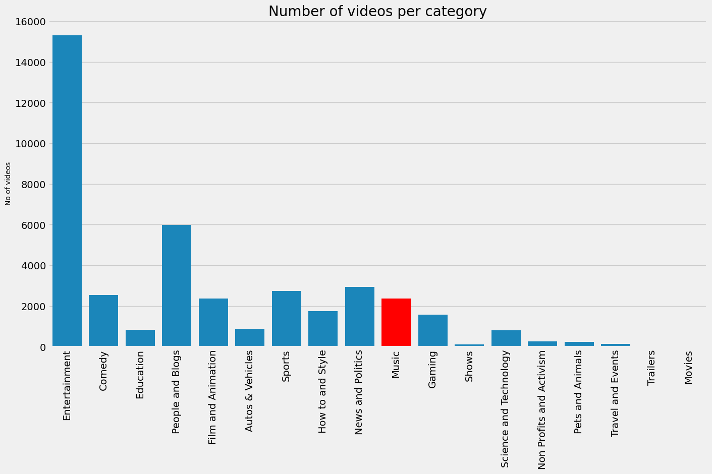
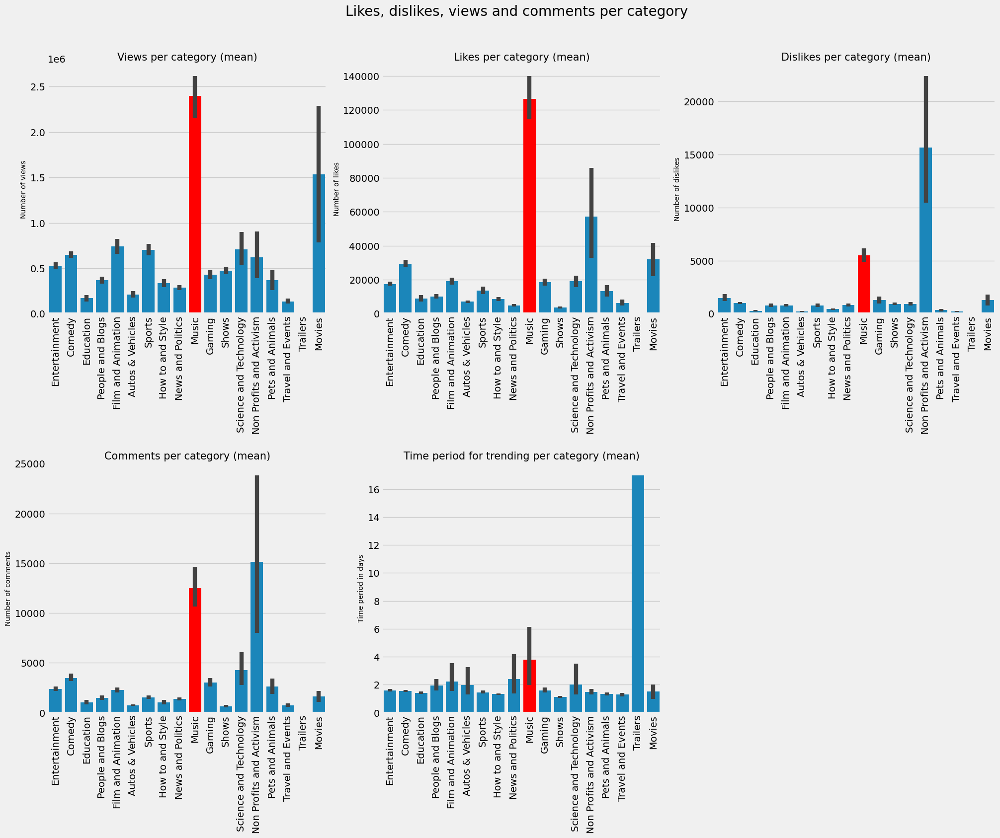
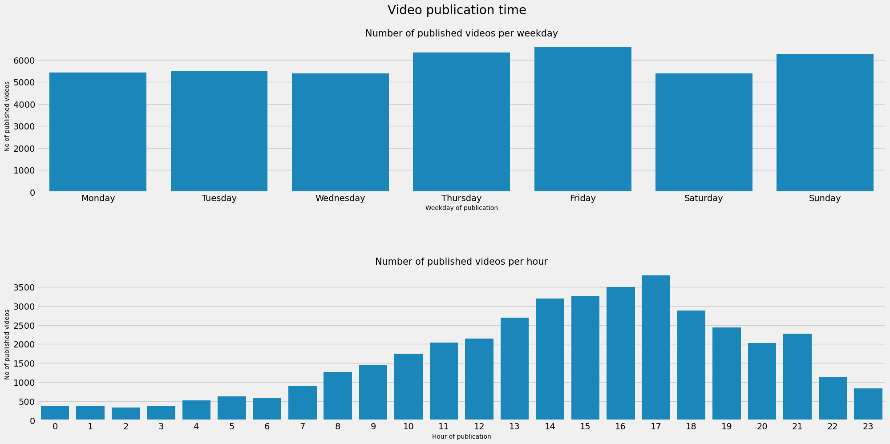

# YouTube Data Analysis (EDA)

 


### 🎯 Objective

This notebook provides a **guided EDA** on daily trending YouTube video statistics (Germany, 2017–2018), focusing on data cleaning, feature engineering, and hypothesis-driven analysis.

### 📊 Dataset

Data sourced from [Kaggle](https://www.kaggle.com/datasnaek/youtube-new), collected via the **YouTube Data API** using the open-source [Trending-YouTube-Scraper](https://github.com/mitchelljy/Trending-YouTube-Scraper).  
The dataset includes metadata for videos ranked on YouTube’s global trending page, which is determined by engagement (views, likes, shares, comments), not total views.

### 🔍 Key Focus

- **Data preprocessing**: Handling missing values, type conversion, and outlier detection  
- **Feature engineering**: Deriving metrics like engagement ratio, video age, and category trends  
- **Visualization**: Using Seaborn and Matplotlib to explore patterns in views, likes, and watch time  

### 🛠️ Technologies Used

- **Python** (3.8+)
- **Pandas** – Data manipulation
- **NumPy** – Numerical operations
- **Matplotlib & Seaborn** – Data visualization
- **Jupyter Notebook** – Interactive analysis
- **Google API Client** (optional) – For data retrieval (if used)

---

### 📂 Project Structure

```
da-youtube_EDA/
├── data/                     # Raw dataset
│   ├── da-youtube_EDA/data/DEvideos.csv
├── youtube_eda.ipynb         # Jupyter notebooks for EDA
├── requirements.txt          # Python dependencies
├── README.md                 # This file
└── LICENSE                   # MIT License
```

---
### 📊 Key Findings 

- Outlier Focussing (The Goal is to find the best Performer)



- Music Category by far not the biggest.



- It may not be the biggest but has a lot of Interaction.



- Best timing to Publish to become trending.



---

### 📚 References

- [YouTube Data API Documentation](https://developers.google.com/youtube/v3)
- [Pandas Documentation](https://pandas.pydata.org/docs/)
- [Seaborn Visualization Guide](https://seaborn.pydata.org/)

---

### 📝 Notes

- This project uses **publicly available YouTube data** collected via Kaggle.
- The analysis is **not affiliated with YouTube or Google**.

---

### 📄 License

This project is licensed under the **MIT License** – see the [LICENSE](LICENSE) file for details.

---

### 📬 Contact

**Author:** Patric Mertes
**Email:** front05@gmx.de 
**GitHub:** [@frive85](https://github.com/frive85)